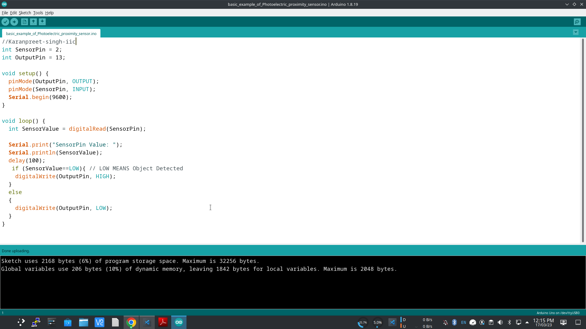

# Arduino IDE 2.x

This repository contains the source code of the Arduino IDE 2.x. If you're looking for the old IDE, go to the repository of the 1.x version at https://github.com/arduino/Arduino.

The Arduino IDE 2.x is a major rewrite, sharing no code with the IDE 1.x. It is based on the [Theia IDE](https://theia-ide.org/) framework and built with [Electron](https://www.electronjs.org/). The backend operations such as compilation and uploading are offloaded to an [arduino-cli](https://github.com/arduino/arduino-cli) instance running in daemon mode. This new IDE was developed with the goal of preserving the same interface and user experience of the previous major version in order to provide a frictionless upgrade.

## Download

You can download the latest release version and nightly builds from the [software download page on the Arduino website](https://www.arduino.cc/en/software).

